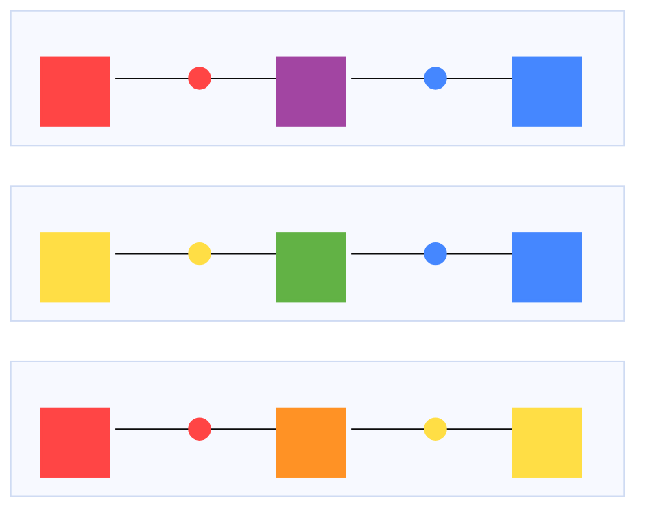

# 三角渴望被连接-TriHorny4Link

一款基于几何图形和颜色混合的塔防游戏。

## 核心概念

通过放置和连接034图形（圆形、矩形、三角形）组合成防御塔或障碍物抵御黑化的034图形敌人，保卫原色水晶的塔防游戏。

**美术风格**：简洁、几何化的蓝图/线框风格

---

## 资源系统

### 核心资源：颜色建筑材料

- 三种原色都有独立的计数
  - 🔴 红色
  - 🔵 蓝色  
  - 🟡 黄色

### 生产方式

主要由**白色能量核心**（一个白色的圆形）以恒定速率持续生产。白色核心会不断产生三种原色资源供玩家使用。

### 消耗规则

- 放置圆形：大量消耗单种颜色
- 放置矩形/三角形：少量消耗相同数量的三种颜色资源

---

## 建筑类型

### 🔵 圆形 - 供能塔

- 具有三原色属性
- 颜色具有影响范围，即自身提供10的能量强度
- 可以在地图任意处放置

#### 能量衰减机制

- **距离计算**：与原色水晶之间的直线距离
- **能量衰减公式**：基础能量值 - (距离格子数 ÷ 衰减基数 × 衰减系数)

距离越远，能量输出越低，但最低不低于设定阈值。

### ⬜ 矩形 - 传导/障碍物

- 作为障碍物，可阻挡或引导敌人路径
- **激活后**：颜色经矩形从圆形朝外传导
- 可以在地图任意处放置

### 🔺 三角形 - 炮塔

- 攻击默认为子弹，激光
- **只能放置在矩形的临边**
- 需要连接在已激活的图形上才能生效

---

## 颜色属性

### 三原色

| 颜色 | 属性 | 攻击类型 | 射程 | 效果 |
|------|------|----------|------|------|
| 🔴 红 | 力量-数量 | 散弹枪 | 近距离 | 以不同角度发射三枚普通子弹射向敌人 |
| 🔵 蓝 | 速度-频率 | 机关枪 | 中距离 | 发射普通子弹，射速快 |
| 🟡 黄 | 能量-精准 | 激光枪 | 远距离 | 发射激光直接命中敌人，但是射速慢 |

### 混合规则

- 圆形具有初始信号值，每经过一个矩形/三角形信号值下降一格
- 颜色混合发生于同时与多种原色的圆形直接或间接连接的**矩形/三角形**
  - 默认为白色
  - 只与一种原色的圆形连接：采用该圆形的颜色
  - 与多种原色的圆形连接：
    - 当存在三种颜色时，当其能量比例为2:>1:<1时，触发偏差混色; 能量比例为2:2:≤1时为混色。
    - 三种原色的能量比例≤2:1:1时为**黑色**

### 混合颜色

| 混合 | 结果 | 攻击类型 | 射程 | 效果 |
|------|------|----------|------|------|
| 🔵+🟡 | 🟢 绿色 | 追踪子弹 | 远距离 | 发射绿色带有拖尾的子弹，子弹速度较快 |
| 🔴+🟡 | 🟠 橙色 | 闪电子弹 | 中距离 | 发射闪电直接命中敌人，并且在一定范围内同时连锁多个敌人一起造成伤害，但存在衰减 |
| 🔴+🔵 | 🟣 紫色 | 爆炸子弹 | 近距离 | 子弹命中或者到生命周期就会直接爆炸，造成范围伤害 |
| ⚫ 黑色 | 特殊 | 炮塔不工作 | - | - |

### 偏差混合色

| 混合 | 结果 | 攻击类型 | 效果 |
|------|------|----------|------|
| 🟢+🔵 | 🟢 蓝绿色 | 追踪分裂子弹 | 命中敌人后子弹分裂成多个子弹再次攻击 |
| 🟢+🟡 | 🟢 黄绿色 | 穿透子弹 | 精准锁定敌人后发射带有拖尾的极速子弹，可以穿透多个目标 |
| 🟠+🔴 | 🟠 橙红色 | 弹射球 | 同时发射多道弹射球，命中敌人后会向其他附近的敌人弹射 |
| 🟠+🟡 | 🟠 橙黄色 | 蓄能激光 | 发射持续激光瞄准一个目标造成伤害，且伤害递增 |
| 🟣+🔴 | 🟣 紫红色 | 集束炸弹 | 发射子弹命中敌人后产生爆炸，随后立刻从爆炸中心散射出数个小的子弹，该爆炸具有范围衰减 |
| 🟣+🔵 | 🟣 紫蓝色 | 持续爆破 | 子弹命中时爆炸，该爆炸具有范围衰减，同时给目标施加减速debuff，且炮塔自身射速在每次射击后变快，一段时间未发射重置射速 |

---

## 放置规则

1. **圆形和矩形**：可以在地图的任意处进行放置
2. **三角形**：只能放置在矩形的临边

---

## 敌人系统

### 敌人AI

- 敌人尽量不会主动攻击矩形障碍，而是尽量会**绕路**
- 玩家可利用这一点，用矩形构建"护城河"或迷宫，引导敌人路线
- 当无法到达原色水晶时，敌人会进行障碍物的破坏

### 敌人生成

- 敌人在距离原色水晶一定距离外生成
- 随着游戏时间推移，敌人会变得更大、更强
- 生成位置会从四面八方涌来，形成包围之势

### 敌人类型

#### 基础敌人

| 类型 | 名称 | 特性 |
|------|------|------|
| 🔺 三角形 | "穿刺者" | 中等血量，移动速度中等 |
| ⬛ 矩形 | "沉重者" | 血量高，移动慢 |
| ⚪️ 圆形 | "连接者" | 通过连接附近的非圆形敌人获得减伤，最多连接5个 |

#### 进阶敌人

| 类型 | 名称 | 特性 |
|------|------|------|
| 🟢 绿色圆形 | "治疗者" | 治疗范围内的受伤敌人，被连接时为其恢复生命值 |
| 💜 紫色矩形 | "分裂者" | 死亡时会分裂成多个小型子敌人继续作战 |
| 🔵 蓝色三角形 | "飞行者" | 具备飞行能力，可越过矩形障碍直接攻击水晶，子弹类型无法命中该敌人 |

#### 敌人体型系统

敌人有20个体型等级，体型越大：

- 血量越高
- 移动速度越慢

---

## 操作说明

### 基础操作

- **鼠标左键**：选择并放置建筑，拖动视角
- **鼠标右键**：取消选择/删除建筑
- **鼠标滚轮**：缩放视角
- **空格键**：打开/关闭 HUD
- **ESC**：暂停

### 游戏流程

1. **准备阶段**：在敌人出现前布置防御工事
2. **战斗阶段**：敌人从四面八方涌来，保卫水晶
3. **波次间隙**：短暂休整，调整防御布局

---

## 游戏目标

保卫原色水晶不被敌人摧毁！击败所有敌人

---

## 结算界面

### 炮塔伤害占比统计

游戏结束时，界面会展示各颜色炮塔对敌人造成的伤害占比：

#### 伤害统计显示

- **按颜色分类**：将所有炮塔造成的伤害按颜色（红色、蓝色、黄色、绿色......）进行分类统计
- **百分比展示**：每种颜色的伤害占总伤害的百分比
- **可视化图表**：使用彩色长条图直观展示各颜色炮塔的贡献比例

#### 隐藏功能

在结束界面按下**空格键**可以显示详细信息：

- 各类敌人的击杀统计
- 存活时间
- 总分数等数据

---

## 技术信息

- **引擎**：Godot 4.6
- **语言**：GDScript
- **分辨率**：支持多种分辨率自适应

---

## 致谢与来源

### 素材来源

- **敌人生成特效Shader**：[Teleport Effect](https://godotshaders.com/shader/teleport-effect/) - Godot Shaders
- **音效**：元气骑士
- **BGM**：MiniMax Music 2.5+ 生成

### 特别感谢

感谢所有开源社区的贡献者！

---

祝游戏愉快！
